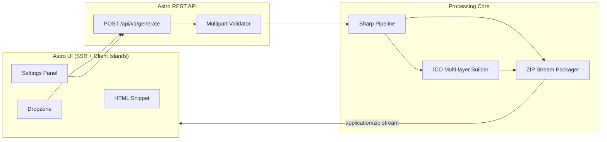

# Iconify — Technical Specification

| Field        | Value                                                                       |
| ------------ | --------------------------------------------------------------------------- |
| **Product**  | Iconify                                                                     |
| **Version**  | 1.0.13                                                                      |
| **Status**   | Draft                                                                       |
| **Stack**    | Astro · Node.js (Astro API routes) · Sharp · archiver                       |
| **Audience** | Engineers implementing Iconify under Specification-Driven Development (SDD) |

---

## 1. Executive Summary

Iconify is a high-performance icon set generator that accepts a single source image (SVG, PNG, or JPG) and produces a complete icon package for the modern web: favicons, Apple Touch icons, Android/PWA assets, Open Graph images, and a copy-paste HTML `<head>` snippet in the UI.

Processing runs server-side via Sharp. The API streams a ZIP archive back to the client so large multi-asset packages never materialize fully on disk.

### 1.1 Goals

| ID  | Goal                                                                                       |
| --- | ------------------------------------------------------------------------------------------ |
| G1  | Generate a complete favicon / PWA / iOS / Android / OG icon set from one upload in seconds |
| G2  | Stream a ZIP response without writing intermediate files to persistent storage             |
| G3  | Expose a versioned REST API (`/api/v1/*`) consumable by the Astro UI and third parties     |
| G4  | Provide a focused UI: dropzone → settings → download ZIP + HTML snippet                    |

### 1.2 Non-Goals (v1)

- Batch multi-file uploads
- Cloud storage / persistent job queues
- User accounts or history
- Custom per-size override editors
- Animated GIF / WebP animation sources

### 1.3 Architecture Overview



### 1.4 Request Lifecycle

1. User drops or selects an image in the Astro UI.
2. Client sends `multipart/form-data` to `POST /api/v1/generate`.
3. API validates MIME type, size (≤ 10 MB), and option fields.
4. Sharp normalizes the buffer (decode → optional greyscale → optional pad/background → resize per target → optional corner-radius mask).
5. Specialized builders emit `.ico`, `.png`, and optional `.svg` assets.
6. Packager pipes all entries into an `archiver` ZIP stream.
7. Response headers set `Content-Type: application/zip` and `Content-Disposition: attachment`.
8. UI offers download of the ZIP package and shows a copy-paste `<head>` snippet (client-side; not included in the ZIP).

### 1.5 Proposed Source Layout

```text
src/
├── pages/
│   ├── index.astro                 # Generator UI
│   └── api/v1/generate.ts          # POST endpoint
├── components/
│   ├── generator.tsx               # Client island: dropzone + settings + download + snippet
│   ├── dropzone.tsx
│   ├── settings-panel.tsx
│   └── html-snippet.tsx
├── lib/
│   ├── icons/
│   │   ├── matrix.ts               # Asset matrix (sizes, names, presets)
│   │   ├── process.ts              # Sharp pipeline
│   │   ├── ico.ts                  # Multi-resolution ICO
│   │   └── package.ts              # ZIP stream assembly
│   ├── snippet.ts                  # HTML <head> generator (UI only)
│   ├── upload-constraints.ts       # Shared MIME / size checks
│   ├── generate-defaults.ts        # Shared GenerateOptions defaults (client-safe)
│   └── validate.ts                 # Multipart / option validation (server)
└── layouts/
    └── app.astro
```

### 1.6 Project file naming

| Kind            | Rule                                     | Examples                                                      |
| --------------- | ---------------------------------------- | ------------------------------------------------------------- |
| Source          | lowercase kebab-case + extension         | `dropzone.tsx`, `settings-panel.tsx`, `upload-constraints.ts` |
| Tests           | same basename + `.test` / `.spec` suffix | `upload-constraints.test.ts`                                  |
| Docs / markdown | **UPPERCASE** basename + `.md`           | `SPEC.md`, `TASKS.md`, `AGENTS.md`, `README.md`               |
| Cursor rules    | lowercase kebab-case                     | `.cursor/rules/sdd.mdc`                                       |

**Exceptions (do not rename to satisfy this rule):**

- Generated ZIP / product asset names in §2 (`favicon.ico`, `apple-touch-icon.png`, …)
- Toolchain or lockfiles required by npm / Node (`package.json`, `package-lock.json`, …)
- Directory names that are framework conventions (e.g. `node_modules`)

Exported TypeScript / React **symbols** may use PascalCase or camelCase (`Dropzone`, `validateSourceFile`); only **file paths** are constrained.

---

## 2. Icon Assets Matrix

All raster outputs are PNG unless noted. Dimensions are width × height in pixels. Naming is fixed so ZIP membership stays deterministic.

### 2.1 Modern Web / Favicons

| Filename                | Size                | Format | Use case                                              |
| ----------------------- | ------------------- | ------ | ----------------------------------------------------- |
| `favicon.ico`           | 16, 32, 48 (layers) | `.ico` | Legacy browsers / bookmarks                           |
| `favicon-16x16.png`     | 16×16               | `.png` | Explicit small favicon                                |
| `favicon-32x32.png`     | 32×32               | `.png` | Standard browser tab icon                             |
| `favicon.svg`           | scalable            | `.svg` | Modern browsers (source SVG only; otherwise omitted)  |
| `safari-pinned-tab.svg` | scalable            | `.svg` | Safari pinned tab (monochrome SVG when source is SVG) |

### 2.2 iOS / Apple Touch

| Filename                       | Size    | Format | Use case                  |
| ------------------------------ | ------- | ------ | ------------------------- |
| `apple-touch-icon-152x152.png` | 152×152 | `.png` | iPad (iOS 7+)             |
| `apple-touch-icon-167x167.png` | 167×167 | `.png` | iPad Pro                  |
| `apple-touch-icon-180x180.png` | 180×180 | `.png` | iPhone (primary)          |
| `apple-touch-icon.png`         | 180×180 | `.png` | Default Apple touch alias |

### 2.3 Android / PWA

| Filename                     | Size    | Format | Use case                  |
| ---------------------------- | ------- | ------ | ------------------------- |
| `android-chrome-192x192.png` | 192×192 | `.png` | Android home screen / PWA |
| `android-chrome-512x512.png` | 512×512 | `.png` | Splash / maskable base    |

### 2.4 Open Graph / Social

| Filename       | Size     | Format | Use case                          |
| -------------- | -------- | ------ | --------------------------------- |
| `og-image.png` | 1200×630 | `.png` | Open Graph / Twitter card preview |

### 2.5 Original size

Single raster export at the source image’s native pixel dimensions, with the same padding / background / corner-radius / monochrome settings as other assets (no resize to a fixed matrix size).

| Filename       | Size                         | Format | Use case                                               |
| -------------- | ---------------------------- | ------ | ------------------------------------------------------ |
| `original.png` | source width × source height | `.png` | Processed export keeping upload dimensions (aspect OK) |

Canvas size equals Sharp metadata `width` × `height` after decode. Non-square sources stay non-square. SVG sources use intrinsic pixel size from the decoded raster; if dimensions are unavailable, return `500 PROCESSING_ERROR`.

### 2.6 Preset Groups

Clients may request subsets via the `presets` form field (comma-separated or repeated):

| Preset ID  | Includes                                                  |
| ---------- | --------------------------------------------------------- |
| `favicon`  | §2.1                                                      |
| `apple`    | §2.2                                                      |
| `android`  | §2.3                                                      |
| `og`       | §2.4                                                      |
| `original` | §2.5                                                      |
| `all`      | §2.1–§2.4 only (default); does **not** include `original` |

`original` is opt-in: combine it with any other preset IDs, or request it alone. Default `presets=all` keeps the platform icon package unchanged.

### 2.7 ZIP Package Layout

```text
iconify-package/
├── favicon.ico
├── favicon-16x16.png
├── favicon-32x32.png
├── favicon.svg                    # if source was SVG
├── apple-touch-icon.png
├── apple-touch-icon-152x152.png
├── apple-touch-icon-167x167.png
├── apple-touch-icon-180x180.png
├── android-chrome-192x192.png
├── android-chrome-512x512.png
├── og-image.png
└── original.png                   # if presets includes original
```

---

## 3. REST API — OpenAPI 3.1 Specification

```yaml
openapi: 3.1.0
info:
  title: Iconify API
  version: 1.0.0
  description: |
    Generate favicon, PWA, iOS, Android, and Open Graph assets from a single image.
    Successful responses stream a ZIP archive.
servers:
  - url: /
paths:
  /api/v1/generate:
    post:
      operationId: generateIconPackage
      summary: Generate icon package ZIP
      description: |
        Accepts a multipart upload and processing options.
        Returns a streamed ZIP (`application/zip`) on success.
      requestBody:
        required: true
        content:
          multipart/form-data:
            schema:
              $ref: '#/components/schemas/GenerateRequest'
            encoding:
              file:
                contentType: image/svg+xml, image/png, image/jpeg
      responses:
        '200':
          description: ZIP archive stream containing generated assets
          headers:
            Content-Disposition:
              schema:
                type: string
              example: attachment; filename="iconify-package.zip"
            X-Iconify-Assets:
              description: Comma-separated list of filenames included in the ZIP
              schema:
                type: string
          content:
            application/zip:
              schema:
                type: string
                format: binary
        '400':
          description: Validation error (bad file, size, or options)
          content:
            application/json:
              schema:
                $ref: '#/components/schemas/ErrorResponse'
              examples:
                invalidType:
                  value:
                    error: VALIDATION_ERROR
                    message: 'Unsupported file type. Allowed: SVG, PNG, JPG.'
                    details:
                      field: file
                tooLarge:
                  value:
                    error: VALIDATION_ERROR
                    message: File exceeds maximum size of 10MB.
                    details:
                      field: file
                      maxBytes: 10485760
        '415':
          description: Unsupported media type (non-multipart request)
          content:
            application/json:
              schema:
                $ref: '#/components/schemas/ErrorResponse'
        '500':
          description: Processing failure (Sharp decode/resize/packaging)
          content:
            application/json:
              schema:
                $ref: '#/components/schemas/ErrorResponse'
              example:
                error: PROCESSING_ERROR
                message: Failed to process image.

components:
  schemas:
    GenerateRequest:
      type: object
      required:
        - file
      properties:
        file:
          type: string
          format: binary
          description: Source image (SVG, PNG, or JPG). Max 10MB.
        background:
          type: string
          pattern: '^#([0-9A-Fa-f]{6}|[0-9A-Fa-f]{8})$'
          default: transparent
          description: |
            Background fill behind padded/resized icons.
            Use `transparent` (literal) or `#RRGGBB` / `#RRGGBBAA`.
        padding:
          type: number
          minimum: 0
          maximum: 50
          default: 0
          description: Padding as percentage of the shorter side (0–50).
        cornerRadius:
          type: number
          minimum: 0
          maximum: 100
          default: 0
          description: |
            Outer corner radius as a percentage of half the shorter canvas side (0–100).
            `0` = square corners; `100` = fully rounded (circle on square icons).
            Applied to raster outputs via an SVG rounded-rect alpha mask after pad/background.
            Does not alter SVG passthrough (`favicon.svg`).
        monochrome:
          type: string
          enum:
            - 'true'
            - 'false'
          default: 'false'
          description: |
            When `true`, convert the uploaded image content to greyscale via Sharp `.greyscale()`
            before compositing onto the background canvas (alpha preserved; `background` color unchanged).
            Applied to raster outputs in `renderIcon` / `renderOgImage` (ICO inherits via `renderIcon`).
            Does not alter SVG passthrough (`favicon.svg`, `safari-pinned-tab.svg`).
            Multipart values must be the literals `true` or `false` (omit → default `false`).
        presets:
          type: string
          default: all
          description: |
            Comma-separated preset IDs: favicon, apple, android, og, original, all.
            `all` expands to favicon+apple+android+og only (not original).
          example: favicon,apple,original

    ErrorResponse:
      type: object
      required:
        - error
        - message
      properties:
        error:
          type: string
          enum:
            - VALIDATION_ERROR
            - PROCESSING_ERROR
            - UNSUPPORTED_MEDIA_TYPE
        message:
          type: string
        details:
          type: object
          additionalProperties: true
```

### 3.1 Status Code Contract

| Code  | When                                             | Body                 |
| ----- | ------------------------------------------------ | -------------------- |
| `200` | Assets generated; ZIP streaming                  | Binary ZIP           |
| `400` | Missing file, bad MIME, >10MB, invalid options   | JSON `ErrorResponse` |
| `415` | Content-Type is not `multipart/form-data`        | JSON `ErrorResponse` |
| `500` | Sharp failure, ICO build failure, ZIP pipe error | JSON `ErrorResponse` |

### 3.2 Constraints

| Constraint         | Value                                        |
| ------------------ | -------------------------------------------- |
| Max upload size    | 10 × 1024 × 1024 bytes (10 MB)               |
| Allowed MIME       | `image/svg+xml`, `image/png`, `image/jpeg`   |
| Allowed extensions | `.svg`, `.png`, `.jpg`, `.jpeg`              |
| Response mode      | Streamed ZIP (no persisted temp files in v1) |
| API versioning     | Path prefix `/api/v1`                        |

---

## 4. Sharp.js Processing Logic

### 4.1 Dependencies

```json
{
  "dependencies": {
    "astro": "^7.1.3",
    "sharp": "^0.34.0",
    "archiver": "^7.0.0",
    "to-ico": "^1.1.5"
  }
}
```

> `to-ico` (or equivalent) builds multi-resolution `.ico` from PNG buffers. If replaced, keep the same public contract: input PNG buffers at 16/32/48 → single `.ico` Buffer.

### 4.2 Types

```typescript
import type { Buffer } from 'node:buffer';

export type PresetId = 'favicon' | 'apple' | 'android' | 'og' | 'original' | 'all';

export interface GenerateOptions {
  background: 'transparent' | `#${string}`;
  padding: number; // 0–50
  cornerRadius: number; // 0–100 (% of half the shorter canvas side)
  monochrome: boolean; // default false — Sharp greyscale on raster content
  presets: PresetId[];
}

export interface AssetEntry {
  name: string; // path inside ZIP
  buffer: Buffer;
  contentType: string;
}

export interface ProcessResult {
  assets: AssetEntry[];
}
```

### 4.3 Normalize + Pad

```typescript
import type { GenerateOptions } from './types';
import { Buffer } from 'node:buffer';
import sharp from 'sharp';

/**
 * Decode source, optionally greyscale, apply padding + background, optionally
 * round outer corners, return a square PNG buffer at `targetSize` suitable for
 * further encoding.
 *
 * Monochrome: when `monochrome` is true, apply Sharp `.greyscale()` to the
 * uploaded image content before compositing onto the background (alpha kept).
 *
 * Corner rounding: when `cornerRadius > 0`, composite an SVG rounded-rect mask
 * with blend `dest-in`. Radius px = round((cornerRadius / 100) * (min(w,h) / 2)).
 */
export async function renderIcon(
  input: Buffer,
  targetSize: number,
  options: Pick<
    GenerateOptions,
    'background' | 'padding' | 'cornerRadius' | 'monochrome'
  >,
): Promise<Buffer> {
  const padRatio = Math.min(Math.max(options.padding, 0), 50) / 100;
  const contentSize = Math.max(1, Math.round(targetSize * (1 - padRatio * 2)));
  const paddingPx = Math.floor((targetSize - contentSize) / 2);

  let pipeline = sharp(input, { density: 300 });
  if (options.monochrome) {
    pipeline = pipeline.greyscale();
  }
  const resized = await pipeline
    .resize(contentSize, contentSize, {
      fit: 'contain',
      background: parseBackground(options.background),
    })
    .png()
    .toBuffer();

  const canvasBg
    = options.background === 'transparent'
      ? { r: 0, g: 0, b: 0, alpha: 0 }
      : parseBackground(options.background);

  let png = await sharp({
    create: {
      width: targetSize,
      height: targetSize,
      channels: 4,
      background: canvasBg,
    },
  })
    .composite([{ input: resized, left: paddingPx, top: paddingPx }])
    .png()
    .toBuffer();

  png = await applyCornerRadius(png, targetSize, targetSize, options.cornerRadius);
  return png;
}

/** Apply outer rounded-rect alpha mask; no-op when radius is 0. */
async function applyCornerRadius(
  png: Buffer,
  width: number,
  height: number,
  cornerRadius: number,
): Promise<Buffer> {
  const clamped = Math.min(Math.max(cornerRadius, 0), 100);
  if (clamped === 0)
    return png;
  const r = Math.round((clamped / 100) * (Math.min(width, height) / 2));
  const mask = Buffer.from(
    `<svg xmlns="http://www.w3.org/2000/svg" width="${width}" height="${height}">
      <rect width="${width}" height="${height}" rx="${r}" ry="${r}" fill="#fff"/>
    </svg>`,
  );
  return sharp(png)
    .composite([{ input: mask, blend: 'dest-in' }])
    .png()
    .toBuffer();
}

function parseBackground(value: GenerateOptions['background']) {
  if (value === 'transparent') {
    return { r: 0, g: 0, b: 0, alpha: 0 };
  }
  const hex = value.replace('#', '');
  const r = Number.parseInt(hex.slice(0, 2), 16);
  const g = Number.parseInt(hex.slice(2, 4), 16);
  const b = Number.parseInt(hex.slice(4, 6), 16);
  const alpha = hex.length === 8 ? Number.parseInt(hex.slice(6, 8), 16) / 255 : 1;
  return { r, g, b, alpha };
}
```

### 4.4 Multi-layer ICO

```typescript
import type { Buffer } from 'node:buffer';
import type { GenerateOptions } from './types';
import toIco from 'to-ico';
import { renderIcon } from './process';

const ICO_SIZES = [16, 32, 48] as const;

export async function buildFaviconIco(
  input: Buffer,
  options: Pick<
    GenerateOptions,
    'background' | 'padding' | 'cornerRadius' | 'monochrome'
  >,
): Promise<Buffer> {
  const layers = await Promise.all(
    ICO_SIZES.map((size) => renderIcon(input, size, options)),
  );
  return toIco(layers);
}
```

### 4.5 OG Image (non-square)

```typescript
import type { Buffer } from 'node:buffer';
import type { GenerateOptions } from './types';
import sharp from 'sharp';

export async function renderOgImage(
  input: Buffer,
  options: Pick<
    GenerateOptions,
    'background' | 'padding' | 'cornerRadius' | 'monochrome'
  >,
): Promise<Buffer> {
  const width = 1200;
  const height = 630;
  const padRatio = Math.min(Math.max(options.padding, 0), 50) / 100;
  const innerW = Math.round(width * (1 - padRatio * 2));
  const innerH = Math.round(height * (1 - padRatio * 2));

  let pipeline = sharp(input, { density: 300 });
  if (options.monochrome) {
    pipeline = pipeline.greyscale();
  }
  const logo = await pipeline
    .resize(innerW, innerH, {
      fit: 'contain',
      background: parseBackground(options.background),
    })
    .png()
    .toBuffer();

  const meta = await sharp(logo).metadata();
  const left = Math.floor((width - (meta.width ?? innerW)) / 2);
  const top = Math.floor((height - (meta.height ?? innerH)) / 2);

  let png = await sharp({
    create: {
      width,
      height,
      channels: 4,
      background: parseBackground(options.background),
    },
  })
    .composite([{ input: logo, left, top }])
    .png()
    .toBuffer();

  png = await applyCornerRadius(png, width, height, options.cornerRadius);
  return png;
}
```

### 4.6 Original size (native dimensions)

```typescript
import type { Buffer } from 'node:buffer';
import type { GenerateOptions } from './types';
import sharp from 'sharp';

/**
 * Same pad / background / corner-radius / monochrome pipeline as `renderOgImage`,
 * but canvas width×height = source metadata (no fixed target resize).
 * Content is fitted with `contain` into the padded inner box; aspect ratio preserved.
 */
export async function renderOriginal(
  input: Buffer,
  options: Pick<
    GenerateOptions,
    'background' | 'padding' | 'cornerRadius' | 'monochrome'
  >,
): Promise<Buffer> {
  const meta = await sharp(input, { density: 300 }).metadata();
  const width = meta.width;
  const height = meta.height;
  if (!width || !height) {
    throw new Error('Source image has no measurable dimensions');
  }

  const padRatio = Math.min(Math.max(options.padding, 0), 50) / 100;
  const innerW = Math.max(1, Math.round(width * (1 - padRatio * 2)));
  const innerH = Math.max(1, Math.round(height * (1 - padRatio * 2)));

  let pipeline = sharp(input, { density: 300 });
  if (options.monochrome) {
    pipeline = pipeline.greyscale();
  }
  const content = await pipeline
    .resize(innerW, innerH, {
      fit: 'contain',
      background: parseBackground(options.background),
    })
    .png()
    .toBuffer();

  const contentMeta = await sharp(content).metadata();
  const left = Math.floor((width - (contentMeta.width ?? innerW)) / 2);
  const top = Math.floor((height - (contentMeta.height ?? innerH)) / 2);

  let png = await sharp({
    create: {
      width,
      height,
      channels: 4,
      background: parseBackground(options.background),
    },
  })
    .composite([{ input: content, left, top }])
    .png()
    .toBuffer();

  png = await applyCornerRadius(png, width, height, options.cornerRadius);
  return png;
}
```

### 4.7 ZIP Stream Packager

```typescript
import type { AssetEntry } from './types';
import { PassThrough, Readable } from 'node:stream';
import archiver from 'archiver';

export function createZipStream(assets: AssetEntry[]): PassThrough {
  const output = new PassThrough();
  const archive = archiver('zip', { zlib: { level: 9 } });

  archive.on('error', (err) => output.destroy(err));
  archive.pipe(output);

  for (const asset of assets) {
    archive.append(asset.buffer, { name: asset.name });
  }

  void archive.finalize();
  return output;
}

/** Astro / Web Response helper */
export function zipToWebResponse(
  assets: AssetEntry[],
  filename = 'iconify-package.zip',
): Response {
  const stream = createZipStream(assets);
  const webStream = Readable.toWeb(stream) as ReadableStream;

  return new Response(webStream, {
    status: 200,
    headers: {
      'Content-Type': 'application/zip',
      'Content-Disposition': `attachment; filename="${filename}"`,
      'Cache-Control': 'no-store',
      'X-Iconify-Assets': assets.map((a) => a.name).join(','),
    },
  });
}
```

### 4.8 Endpoint Skeleton (Astro)

```typescript
// src/pages/api/v1/generate.ts
import type { APIRoute } from 'astro';
import { processIconPackage, zipToWebResponse } from '../../../lib/icons/package';
import { parseGenerateForm } from '../../../lib/validate';

export const prerender = false;

export const POST: APIRoute = async ({ request }) => {
  try {
    const contentType = request.headers.get('content-type') ?? '';
    if (!contentType.includes('multipart/form-data')) {
      return jsonError(415, 'UNSUPPORTED_MEDIA_TYPE', 'Expected multipart/form-data.');
    }

    const form = await request.formData();
    const parsed = await parseGenerateForm(form);
    if (!parsed.ok) {
      return jsonError(400, 'VALIDATION_ERROR', parsed.message, parsed.details);
    }

    const result = await processIconPackage(parsed.file, parsed.options);
    return zipToWebResponse(result.assets);
  } catch (err) {
    console.error('[iconify] generate failed', err);
    return jsonError(500, 'PROCESSING_ERROR', 'Failed to process image.');
  }
};

function jsonError(
  status: number,
  error: string,
  message: string,
  details?: Record<string, unknown>,
) {
  return new Response(JSON.stringify({ error, message, details }), {
    status,
    headers: { 'Content-Type': 'application/json' },
  });
}
```

### 4.9 Processing Rules

| Rule              | Behavior                                                                                                          |
| ----------------- | ----------------------------------------------------------------------------------------------------------------- |
| SVG input         | Preserve `favicon.svg` (and optional pinned-tab) as original/sanitized SVG; rasters via Sharp density 300         |
| Raster input      | Skip SVG outputs; still produce all PNG/ICO targets                                                               |
| Transparency      | Default background `transparent`; PNG stays alpha; ICO flattens per `to-ico` behavior                             |
| Padding           | Applied uniformly as % inset; content uses `fit: 'contain'`                                                       |
| Monochrome        | When `monochrome=true`, Sharp `.greyscale()` on upload content before background composite; SVG passthrough skip  |
| Original preset   | `original.png` at source metadata width×height; same options as other rasters; not part of `presets=all`          |
| Failure isolation | Any Sharp throw → 500; never start ZIP stream after a mid-pipeline failure (build all buffers first, then stream) |

---

## 5. Astro UI / UX Specification

### 5.1 Page Structure

Single route: `/` (`src/pages/index.astro`) inside `app.astro` layout.

```text
┌─────────────────────────────────────────────────────────┐
│  [app icon]  Iconify                                     │
│              High-performance icon set generator         │
│              Short product description (one upload →     │
│              favicons, PWA/iOS, OG, HTML snippet)        │
├────────────────────────────┬────────────────────────────┤
│  Dropzone                  │  Settings                   │
│  • drag & drop             │  • padding %                │
│  • click to browse         │  • corner radius %          │
│  • file meta + clear       │  • monochrome (toggle)      │
│                            │  • background color         │
│                            │  • presets (checkboxes)     │
├────────────────────────────┴────────────────────────────┤
│  [ Generate & Download ZIP ]                             │
├─────────────────────────────────────────────────────────┤
│  HTML <head> snippet                    [ Copy ]         │
└─────────────────────────────────────────────────────────┘
```

Header brand mark uses an existing `public/` icon (e.g. `android-chrome-192x192.png`); do not invent filenames.

### 5.2 Workflow

| Step | Actor | Behavior                                                                        |
| ---- | ----- | ------------------------------------------------------------------------------- |
| 1    | User  | Drops/selects SVG/PNG/JPG ≤ 10 MB                                               |
| 2    | UI    | Validates client-side; shows filename, size, MIME; enables settings             |
| 3    | User  | Toggles presets, adjusts padding / corner radius / monochrome, picks background |
| 4    | User  | Clicks **Generate & Download ZIP**                                              |
| 5    | UI    | `POST /api/v1/generate` with `FormData`; shows progress/disabled state          |
| 6    | UI    | On 200: trigger browser download from blob URL; populate snippet panel          |
| 7    | UI    | On 4xx/5xx: show inline error from JSON `message`                               |

### 5.3 Component Contracts

#### Dropzone (client island)

- Accept: `.svg,.png,.jpg,.jpeg` / matching MIME list
- States: idle · dragging · ready · error
- Reject quietly with message if type/size invalid
- Expose selected `File` to parent via callback

#### Settings Panel

| Control       | Type                         | Default     | Notes                                                                            |
| ------------- | ---------------------------- | ----------- | -------------------------------------------------------------------------------- |
| Padding       | range / number               | `0`         | 0–50, step 1, suffix `%`                                                         |
| Corner radius | range / number               | `0`         | 0–100, step 1, suffix `%` of half shorter side; rounds outer canvas              |
| Monochrome    | checkbox / switch            | off         | Sends `monochrome=true` \| `false`; greyscale raster content only                |
| Background    | color + “transparent” toggle | transparent | Sends `transparent` or `#RRGGBB`                                                 |
| Presets       | checkbox group               | all         | Maps to `presets`; includes opt-in **Original** (`original`) — not part of `all` |

#### HTML Snippet

UI-only copy-paste markup (not written into the ZIP). Generated client-side after a successful generate:

```html
<link rel="icon" href="/favicon.ico" sizes="any" />
<link rel="icon" href="/favicon.svg" type="image/svg+xml" />
<link rel="icon" type="image/png" sizes="32x32" href="/favicon-32x32.png" />
<link rel="icon" type="image/png" sizes="16x16" href="/favicon-16x16.png" />
<link rel="apple-touch-icon" sizes="180x180" href="/apple-touch-icon.png" />
<meta property="og:image" content="/og-image.png" />
```

Omit the SVG `<link>` when source was not SVG. **Copy** button uses `navigator.clipboard.writeText`.

### 5.4 Accessibility & UX Rules

- Dropzone is a `<button>` or `role="button"` with keyboard activation
- Color inputs have text hex fallbacks
- Generate button disabled until a valid file is present
- Announce errors via `aria-live="polite"`
- No cards-for-decoration; settings and dropzone are interaction surfaces only

### 5.5 Client ↔ API Mapping

```typescript
const body = new FormData();
body.set('file', file);
body.set('padding', String(padding));
body.set('cornerRadius', String(cornerRadius));
body.set('monochrome', monochrome ? 'true' : 'false');
body.set('background', transparent ? 'transparent' : backgroundHex);
body.set('presets', selectedPresets.join(','));

const res = await fetch('/api/v1/generate', { method: 'POST', body });
```

### 5.6 Site document head (SEO & social)

Applies to the product page document (`src/layouts/app.astro` on `/`). This is **not** the generated ZIP HTML snippet (§5.3). Use only static files already shipped under `public/` — do not invent new asset filenames.

#### Canonical origin

- Set Astro `site` in `astro.config.js` to the canonical public origin.
- Resolve as `https://${process.env.VERCEL_URL}` when `VERCEL_URL` is set (Vercel deploy); otherwise `http://localhost:4321` (Astro default local origin) so absolute URLs resolve in development.
- Resolve `og:url`, `link[rel=canonical]`, and all social image URLs as **absolute** URLs from that origin (relative `og:image` / `twitter:image` are invalid for crawlers).

#### Favicons & touch icons (`public/`)

| File                           | Document head usage                                      |
| ------------------------------ | -------------------------------------------------------- |
| `favicon.ico`                  | `<link rel="icon" href="…" sizes="any" />`               |
| `favicon-16x16.png`            | `<link rel="icon" type="image/png" sizes="16x16" … />`   |
| `favicon-32x32.png`            | `<link rel="icon" type="image/png" sizes="32x32" … />`   |
| `apple-touch-icon.png`         | `<link rel="apple-touch-icon" sizes="180x180" … />`      |
| `apple-touch-icon-152x152.png` | `<link rel="apple-touch-icon" sizes="152x152" … />`      |
| `apple-touch-icon-167x167.png` | `<link rel="apple-touch-icon" sizes="167x167" … />`      |
| `apple-touch-icon-180x180.png` | `<link rel="apple-touch-icon" sizes="180x180" … />`      |
| `android-chrome-192x192.png`   | `<link rel="icon" type="image/png" sizes="192x192" … />` |
| `android-chrome-512x512.png`   | `<link rel="icon" type="image/png" sizes="512x512" … />` |

No `site.webmanifest` in v1 (see document history).

#### Core SEO

| Tag                         | Value                                |
| --------------------------- | ------------------------------------ |
| `<title>`                   | Product name (`package.json` `name`) |
| `<meta name="description">` | Product description (`package.json`) |
| `<link rel="canonical">`    | Absolute URL of `/`                  |

#### Open Graph

| Property          | Value                                    |
| ----------------- | ---------------------------------------- |
| `og:type`         | `website`                                |
| `og:locale`       | `en_US`                                  |
| `og:site_name`    | Product name                             |
| `og:title`        | Product name                             |
| `og:description`  | Product description                      |
| `og:url`          | Absolute URL of `/`                      |
| `og:image`        | Absolute URL of `/og-image.png`          |
| `og:image:width`  | `1200`                                   |
| `og:image:height` | `630`                                    |
| `og:image:type`   | `image/png`                              |
| `og:image:alt`    | Short alt describing the product preview |

`public/og-image.png` is 1200×630 (matches §2.4 dimensions).

#### Twitter Card

| Name                  | Value                           |
| --------------------- | ------------------------------- |
| `twitter:card`        | `summary_large_image`           |
| `twitter:title`       | Product name                    |
| `twitter:description` | Product description             |
| `twitter:image`       | Absolute URL of `/og-image.png` |
| `twitter:image:alt`   | Same alt as `og:image:alt`      |

---

## 6. Milestones & Task Breakdown

Implementation progress lives in one place: [`TASKS.md`](./TASKS.md) (M0–M5 checklist + verification shortcuts against §7).

Do not duplicate milestone checklists here. When scope changes, update this SPEC (requirements) and adjust `TASKS.md` (work items) accordingly.

**Done means green tests.** Do not check off a `TASKS.md` item (or treat a milestone as complete) unless `npm run test:unit` (Vitest) passes for all tests that cover that slice. If a slice has no tests yet, add them first, then mark done only after they pass.

---

## 7. Acceptance Criteria

| ID   | Criterion                                                                                                                                                                                                                                                                             |
| ---- | ------------------------------------------------------------------------------------------------------------------------------------------------------------------------------------------------------------------------------------------------------------------------------------- |
| AC1  | Upload PNG ≤ 10 MB with preset `all` returns ZIP containing every §2.1–2.4 file (SVG outputs excluded)                                                                                                                                                                                |
| AC2  | Upload SVG returns ZIP that also includes `favicon.svg`                                                                                                                                                                                                                               |
| AC3  | Invalid MIME or >10 MB returns `400` JSON with `VALIDATION_ERROR`                                                                                                                                                                                                                     |
| AC4  | `padding=20` visibly insets icon content in generated PNG assets                                                                                                                                                                                                                      |
| AC5  | `favicon.ico` contains 16, 32, and 48 px layers                                                                                                                                                                                                                                       |
| AC6  | UI can download ZIP and copy `<head>` snippet in one session without reload                                                                                                                                                                                                           |
| AC7  | No intermediate icon files persist on disk after the request completes                                                                                                                                                                                                                |
| AC8  | `cornerRadius=100` on a square PNG yield produces circular (fully rounded) raster icons; `cornerRadius=0` leaves square corners; invalid values (`-1`, `101`) return `400 VALIDATION_ERROR`                                                                                           |
| AC9  | Document head on `/` wires every §5.6 `public/` icon, absolute Open Graph + Twitter Card tags for `/og-image.png` (1200×630), and canonical / `og:url` from Astro `site`                                                                                                              |
| AC10 | `monochrome=true` yields greyscale raster PNG/ICO content (chroma ≈ 0); `monochrome=false` / omitted keeps source colors; invalid values return `400 VALIDATION_ERROR`; SVG passthrough unchanged                                                                                     |
| AC11 | `presets=original` alone yields ZIP with only `original.png` at source width×height; padding / background / cornerRadius / monochrome still apply; `presets=all` does **not** include `original.png`; combining `original` with other presets adds the file alongside §2.1–2.4 assets |

---

## 8. SDD Governance

1. **`SPEC.md` is the source of truth.** Implementation follows this document; code does not invent API fields or asset names.
2. **Spec before code.** Requirement changes update SPEC (and OpenAPI section) first; adjust `TASKS.md` checkboxes if the work breakdown changes; then implement.
3. **Drift is a defect.** If code and SPEC disagree, fix the drift in the same change set (prefer updating code to match SPEC unless the SPEC change is intentional).
4. **Agents** must read `AGENTS.md` and `.cursor/rules/*` before implementing features.
5. **Green tests before done.** A `TASKS.md` checkbox may be marked complete only when Vitest is green for the covered slice (`npm run test:unit` exit 0).
6. **File naming.** Project-authored paths follow §1.6 (source: lowercase kebab-case; markdown: UPPERCASE).

---

## Document History

| Version | Date       | Notes                                                                      |
| ------- | ---------- | -------------------------------------------------------------------------- |
| 1.0.0   | 2026-07-23 | Initial technical specification                                            |
| 1.0.1   | 2026-07-23 | §6 milestones checklist moved solely to `TASKS.md`                         |
| 1.0.2   | 2026-07-23 | §6 / §8: mark `TASKS.md` items done only when `npm run test:unit` is green |
| 1.0.3   | 2026-07-23 | §1.6 lowercase kebab-case for source; layout paths updated                 |
| 1.0.4   | 2026-07-23 | §1.6 markdown docs use UPPERCASE basenames (`SPEC.md`, …)                  |
| 1.0.5   | 2026-07-23 | §1.5 layout: `generator.tsx` island + `preview.ts` client approx.          |
| 1.0.6   | 2026-07-23 | Remove live preview grid from UI (§1.1 G4, §1.3, §1.5, §5)                 |
| 1.0.7   | 2026-07-23 | Remove `site.webmanifest` and `head.html` from package + UI                |
| 1.0.8   | 2026-07-23 | Restore UI HTML `<head>` snippet (client-only; still omitted from ZIP)     |
| 1.0.9   | 2026-07-23 | §5.6 site document head: SEO, Open Graph, Twitter Card via `public/`       |
| 1.0.10  | 2026-07-23 | §5.1 header: `public/` brand icon + short product description              |
| 1.0.11  | 2026-07-23 | `cornerRadius` range 0–100 (`100` = full circle); AC8 updated              |
| 1.0.12  | 2026-07-23 | `monochrome` option (Sharp greyscale); UI + API; AC10                      |
| 1.0.13  | 2026-07-23 | Preset `original` → `original.png` at source size; AC11                    |
