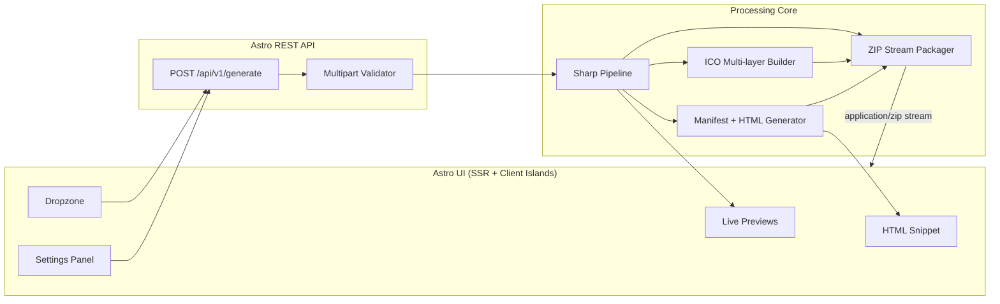

# Iconify — Technical Specification

| Field | Value |
| --- | --- |
| **Product** | Iconify |
| **Version** | 1.0.1 |
| **Status** | Draft |
| **Stack** | Astro · Node.js (Astro API routes) · Sharp · archiver |
| **Audience** | Engineers implementing Iconify under Specification-Driven Development (SDD) |

---

## 1. Executive Summary

Iconify is a high-performance icon set generator that accepts a single source image (SVG, PNG, or JPG) and produces a complete icon package for the modern web: favicons, Apple Touch icons, Android/PWA assets, Open Graph images, a `site.webmanifest`, and copy-paste HTML `<head>` snippets.

Processing runs server-side via Sharp. The API streams a ZIP archive back to the client so large multi-asset packages never materialize fully on disk.

### 1.1 Goals

| ID | Goal |
| --- | --- |
| G1 | Generate a complete favicon / PWA / iOS / Android / OG icon set from one upload in seconds |
| G2 | Stream a ZIP response without writing intermediate files to persistent storage |
| G3 | Expose a versioned REST API (`/api/v1/*`) consumable by the Astro UI and third parties |
| G4 | Provide a focused UI: dropzone → settings → live preview → download + HTML snippet |

### 1.2 Non-Goals (v1)

- Batch multi-file uploads
- Cloud storage / persistent job queues
- User accounts or history
- Custom per-size override editors
- Animated GIF / WebP animation sources

### 1.3 Architecture Overview



### 1.4 Request Lifecycle

1. User drops or selects an image in the Astro UI.
2. Client sends `multipart/form-data` to `POST /api/v1/generate`.
3. API validates MIME type, size (≤ 10 MB), and option fields.
4. Sharp normalizes the buffer (decode → optional pad/background → resize per target).
5. Specialized builders emit `.ico`, `.png`, optional `.svg`, `site.webmanifest`, and `head.html`.
6. Packager pipes all entries into an `archiver` ZIP stream.
7. Response headers set `Content-Type: application/zip` and `Content-Disposition: attachment`.
8. UI offers download; snippet panel shows the generated `<head>` markup for copy.

### 1.5 Proposed Source Layout

```text
src/
├── pages/
│   ├── index.astro                 # Generator UI
│   └── api/v1/generate.ts          # POST endpoint
├── components/
│   ├── Dropzone.tsx                # Client island
│   ├── SettingsPanel.tsx
│   ├── PreviewGrid.tsx
│   └── HtmlSnippet.tsx
├── lib/
│   ├── icons/
│   │   ├── matrix.ts               # Asset matrix (sizes, names, presets)
│   │   ├── process.ts              # Sharp pipeline
│   │   ├── ico.ts                  # Multi-resolution ICO
│   │   └── package.ts              # ZIP stream assembly
│   ├── manifest.ts                 # site.webmanifest builder
│   ├── snippet.ts                  # HTML <head> generator
│   └── validate.ts                 # Multipart / option validation
└── layouts/
    └── app.astro
```

---

## 2. Icon Assets Matrix

All raster outputs are PNG unless noted. Dimensions are width × height in pixels. Naming is fixed so HTML snippets and the manifest stay deterministic.

### 2.1 Modern Web / Favicons

| Filename | Size | Format | Use case |
| --- | --- | --- | --- |
| `favicon.ico` | 16, 32, 48 (layers) | `.ico` | Legacy browsers / bookmarks |
| `favicon-16x16.png` | 16×16 | `.png` | Explicit small favicon |
| `favicon-32x32.png` | 32×32 | `.png` | Standard browser tab icon |
| `favicon.svg` | scalable | `.svg` | Modern browsers (source SVG only; otherwise omitted) |
| `safari-pinned-tab.svg` | scalable | `.svg` | Safari pinned tab (monochrome SVG when source is SVG) |

### 2.2 iOS / Apple Touch

| Filename | Size | Format | Use case |
| --- | --- | --- | --- |
| `apple-touch-icon-152x152.png` | 152×152 | `.png` | iPad (iOS 7+) |
| `apple-touch-icon-167x167.png` | 167×167 | `.png` | iPad Pro |
| `apple-touch-icon-180x180.png` | 180×180 | `.png` | iPhone (primary) |
| `apple-touch-icon.png` | 180×180 | `.png` | Default Apple touch alias |

### 2.3 Android / PWA

| Filename | Size | Format | Use case |
| --- | --- | --- | --- |
| `android-chrome-192x192.png` | 192×192 | `.png` | Android home screen / PWA |
| `android-chrome-512x512.png` | 512×512 | `.png` | Splash / maskable base |
| `site.webmanifest` | — | `.webmanifest` (JSON) | PWA install metadata |

**`site.webmanifest` shape (generated):**

```json
{
  "name": "App",
  "short_name": "App",
  "icons": [
    {
      "src": "/android-chrome-192x192.png",
      "sizes": "192x192",
      "type": "image/png"
    },
    {
      "src": "/android-chrome-512x512.png",
      "sizes": "512x512",
      "type": "image/png"
    }
  ],
  "theme_color": "#ffffff",
  "background_color": "#ffffff",
  "display": "standalone"
}
```

`name`, `short_name`, `theme_color`, and `background_color` are overridable via API form fields (see §3).

### 2.4 Open Graph / Social

| Filename | Size | Format | Use case |
| --- | --- | --- | --- |
| `og-image.png` | 1200×630 | `.png` | Open Graph / Twitter card preview |

### 2.5 Preset Groups

Clients may request subsets via the `presets` form field (comma-separated or repeated):

| Preset ID | Includes |
| --- | --- |
| `favicon` | §2.1 |
| `apple` | §2.2 |
| `android` | §2.3 (icons + manifest) |
| `og` | §2.4 |
| `all` | Everything above (default) |

### 2.6 ZIP Package Layout

```text
iconify-package/
├── favicon.ico
├── favicon-16x16.png
├── favicon-32x32.png
├── favicon.svg                    # if source was SVG
├── apple-touch-icon.png
├── apple-touch-icon-152x152.png
├── apple-touch-icon-167x167.png
├── apple-touch-icon-180x180.png
├── android-chrome-192x192.png
├── android-chrome-512x512.png
├── og-image.png
├── site.webmanifest
└── head.html                      # copy-paste <head> fragment
```

---

## 3. REST API — OpenAPI 3.1 Specification

```yaml
openapi: 3.1.0
info:
  title: Iconify API
  version: 1.0.0
  description: |
    Generate favicon, PWA, iOS, Android, and Open Graph assets from a single image.
    Successful responses stream a ZIP archive.
servers:
  - url: /
paths:
  /api/v1/generate:
    post:
      operationId: generateIconPackage
      summary: Generate icon package ZIP
      description: |
        Accepts a multipart upload and processing options.
        Returns a streamed ZIP (`application/zip`) on success.
      requestBody:
        required: true
        content:
          multipart/form-data:
            schema:
              $ref: '#/components/schemas/GenerateRequest'
            encoding:
              file:
                contentType: image/svg+xml, image/png, image/jpeg
      responses:
        '200':
          description: ZIP archive stream containing generated assets
          headers:
            Content-Disposition:
              schema:
                type: string
              example: attachment; filename="iconify-package.zip"
            X-Iconify-Assets:
              description: Comma-separated list of filenames included in the ZIP
              schema:
                type: string
          content:
            application/zip:
              schema:
                type: string
                format: binary
        '400':
          description: Validation error (bad file, size, or options)
          content:
            application/json:
              schema:
                $ref: '#/components/schemas/ErrorResponse'
              examples:
                invalidType:
                  value:
                    error: 'VALIDATION_ERROR'
                    message: 'Unsupported file type. Allowed: SVG, PNG, JPG.'
                    details:
                      field: file
                tooLarge:
                  value:
                    error: 'VALIDATION_ERROR'
                    message: 'File exceeds maximum size of 10MB.'
                    details:
                      field: file
                      maxBytes: 10485760
        '415':
          description: Unsupported media type (non-multipart request)
          content:
            application/json:
              schema:
                $ref: '#/components/schemas/ErrorResponse'
        '500':
          description: Processing failure (Sharp decode/resize/packaging)
          content:
            application/json:
              schema:
                $ref: '#/components/schemas/ErrorResponse'
              example:
                error: 'PROCESSING_ERROR'
                message: 'Failed to process image.'

components:
  schemas:
    GenerateRequest:
      type: object
      required:
        - file
      properties:
        file:
          type: string
          format: binary
          description: Source image (SVG, PNG, or JPG). Max 10MB.
        background:
          type: string
          pattern: '^#([0-9A-Fa-f]{6}|[0-9A-Fa-f]{8})$'
          default: 'transparent'
          description: |
            Background fill behind padded/resized icons.
            Use `transparent` (literal) or `#RRGGBB` / `#RRGGBBAA`.
        padding:
          type: number
          minimum: 0
          maximum: 50
          default: 0
          description: Padding as percentage of the shorter side (0–50).
        presets:
          type: string
          default: all
          description: |
            Comma-separated preset IDs: favicon, apple, android, og, all.
          example: favicon,apple,android
        appName:
          type: string
          maxLength: 64
          default: App
          description: Manifest `name` / `short_name` base.
        themeColor:
          type: string
          pattern: '^#[0-9A-Fa-f]{6}$'
          default: '#ffffff'
        backgroundColor:
          type: string
          pattern: '^#[0-9A-Fa-f]{6}$'
          default: '#ffffff'
          description: Manifest background_color (distinct from icon pad fill).

    ErrorResponse:
      type: object
      required:
        - error
        - message
      properties:
        error:
          type: string
          enum:
            - VALIDATION_ERROR
            - PROCESSING_ERROR
            - UNSUPPORTED_MEDIA_TYPE
        message:
          type: string
        details:
          type: object
          additionalProperties: true
```

### 3.1 Status Code Contract

| Code | When | Body |
| --- | --- | --- |
| `200` | Assets generated; ZIP streaming | Binary ZIP |
| `400` | Missing file, bad MIME, >10MB, invalid options | JSON `ErrorResponse` |
| `415` | Content-Type is not `multipart/form-data` | JSON `ErrorResponse` |
| `500` | Sharp failure, ICO build failure, ZIP pipe error | JSON `ErrorResponse` |

### 3.2 Constraints

| Constraint | Value |
| --- | --- |
| Max upload size | 10 × 1024 × 1024 bytes (10 MB) |
| Allowed MIME | `image/svg+xml`, `image/png`, `image/jpeg` |
| Allowed extensions | `.svg`, `.png`, `.jpg`, `.jpeg` |
| Response mode | Streamed ZIP (no persisted temp files in v1) |
| API versioning | Path prefix `/api/v1` |

---

## 4. Sharp.js Processing Logic

### 4.1 Dependencies

```json
{
  "dependencies": {
    "astro": "^7.1.3",
    "sharp": "^0.34.0",
    "archiver": "^7.0.0",
    "to-ico": "^1.1.5"
  }
}
```

> `to-ico` (or equivalent) builds multi-resolution `.ico` from PNG buffers. If replaced, keep the same public contract: input PNG buffers at 16/32/48 → single `.ico` Buffer.

### 4.2 Types

```typescript
export type PresetId = 'favicon' | 'apple' | 'android' | 'og' | 'all';

export interface GenerateOptions {
  background: 'transparent' | `#${string}`;
  padding: number; // 0–50
  presets: PresetId[];
  appName: string;
  themeColor: string;
  backgroundColor: string;
}

export interface AssetEntry {
  name: string; // path inside ZIP
  buffer: Buffer;
  contentType: string;
}

export interface ProcessResult {
  assets: AssetEntry[];
  headHtml: string;
  manifestJson: string;
}
```

### 4.3 Normalize + Pad

```typescript
import sharp from 'sharp';
import type { GenerateOptions } from './types';

/**
 * Decode source, apply padding + background, return a square PNG buffer
 * at `targetSize` suitable for further encoding.
 */
export async function renderIcon(
  input: Buffer,
  targetSize: number,
  options: Pick<GenerateOptions, 'background' | 'padding'>,
): Promise<Buffer> {
  const padRatio = Math.min(Math.max(options.padding, 0), 50) / 100;
  const contentSize = Math.max(1, Math.round(targetSize * (1 - padRatio * 2)));
  const paddingPx = Math.floor((targetSize - contentSize) / 2);

  const resized = await sharp(input, { density: 300 })
    .resize(contentSize, contentSize, {
      fit: 'contain',
      background: parseBackground(options.background),
    })
    .png()
    .toBuffer();

  const canvasBg =
    options.background === 'transparent'
      ? { r: 0, g: 0, b: 0, alpha: 0 }
      : parseBackground(options.background);

  return sharp({
    create: {
      width: targetSize,
      height: targetSize,
      channels: 4,
      background: canvasBg,
    },
  })
    .composite([{ input: resized, left: paddingPx, top: paddingPx }])
    .png()
    .toBuffer();
}

function parseBackground(value: GenerateOptions['background']) {
  if (value === 'transparent') {
    return { r: 0, g: 0, b: 0, alpha: 0 };
  }
  const hex = value.replace('#', '');
  const r = parseInt(hex.slice(0, 2), 16);
  const g = parseInt(hex.slice(2, 4), 16);
  const b = parseInt(hex.slice(4, 6), 16);
  const alpha = hex.length === 8 ? parseInt(hex.slice(6, 8), 16) / 255 : 1;
  return { r, g, b, alpha };
}
```

### 4.4 Multi-layer ICO

```typescript
import toIco from 'to-ico';
import { renderIcon } from './process';
import type { GenerateOptions } from './types';

const ICO_SIZES = [16, 32, 48] as const;

export async function buildFaviconIco(
  input: Buffer,
  options: Pick<GenerateOptions, 'background' | 'padding'>,
): Promise<Buffer> {
  const layers = await Promise.all(
    ICO_SIZES.map((size) => renderIcon(input, size, options)),
  );
  return toIco(layers);
}
```

### 4.5 OG Image (non-square)

```typescript
export async function renderOgImage(
  input: Buffer,
  options: Pick<GenerateOptions, 'background' | 'padding'>,
): Promise<Buffer> {
  const width = 1200;
  const height = 630;
  const padRatio = Math.min(Math.max(options.padding, 0), 50) / 100;
  const innerW = Math.round(width * (1 - padRatio * 2));
  const innerH = Math.round(height * (1 - padRatio * 2));

  const logo = await sharp(input, { density: 300 })
    .resize(innerW, innerH, {
      fit: 'contain',
      background: parseBackground(options.background),
    })
    .png()
    .toBuffer();

  const meta = await sharp(logo).metadata();
  const left = Math.floor((width - (meta.width ?? innerW)) / 2);
  const top = Math.floor((height - (meta.height ?? innerH)) / 2);

  return sharp({
    create: {
      width,
      height,
      channels: 4,
      background: parseBackground(options.background),
    },
  })
    .composite([{ input: logo, left, top }])
    .png()
    .toBuffer();
}
```

### 4.6 ZIP Stream Packager

```typescript
import { Readable, PassThrough } from 'node:stream';
import archiver from 'archiver';
import type { AssetEntry } from './types';

export function createZipStream(assets: AssetEntry[]): PassThrough {
  const output = new PassThrough();
  const archive = archiver('zip', { zlib: { level: 9 } });

  archive.on('error', (err) => output.destroy(err));
  archive.pipe(output);

  for (const asset of assets) {
    archive.append(asset.buffer, { name: asset.name });
  }

  void archive.finalize();
  return output;
}

/** Astro / Web Response helper */
export function zipToWebResponse(
  assets: AssetEntry[],
  filename = 'iconify-package.zip',
): Response {
  const stream = createZipStream(assets);
  const webStream = Readable.toWeb(stream) as ReadableStream;

  return new Response(webStream, {
    status: 200,
    headers: {
      'Content-Type': 'application/zip',
      'Content-Disposition': `attachment; filename="${filename}"`,
      'Cache-Control': 'no-store',
      'X-Iconify-Assets': assets.map((a) => a.name).join(','),
    },
  });
}
```

### 4.7 Endpoint Skeleton (Astro)

```typescript
// src/pages/api/v1/generate.ts
import type { APIRoute } from 'astro';
import { parseGenerateForm } from '../../../lib/validate';
import { processIconPackage } from '../../../lib/icons/package';
import { zipToWebResponse } from '../../../lib/icons/package';

export const prerender = false;

export const POST: APIRoute = async ({ request }) => {
  try {
    const contentType = request.headers.get('content-type') ?? '';
    if (!contentType.includes('multipart/form-data')) {
      return jsonError(415, 'UNSUPPORTED_MEDIA_TYPE', 'Expected multipart/form-data.');
    }

    const form = await request.formData();
    const parsed = await parseGenerateForm(form);
    if (!parsed.ok) {
      return jsonError(400, 'VALIDATION_ERROR', parsed.message, parsed.details);
    }

    const result = await processIconPackage(parsed.file, parsed.options);
    return zipToWebResponse(result.assets);
  } catch (err) {
    console.error('[iconify] generate failed', err);
    return jsonError(500, 'PROCESSING_ERROR', 'Failed to process image.');
  }
};

function jsonError(
  status: number,
  error: string,
  message: string,
  details?: Record<string, unknown>,
) {
  return new Response(JSON.stringify({ error, message, details }), {
    status,
    headers: { 'Content-Type': 'application/json' },
  });
}
```

### 4.8 Processing Rules

| Rule | Behavior |
| --- | --- |
| SVG input | Preserve `favicon.svg` (and optional pinned-tab) as original/sanitized SVG; rasters via Sharp density 300 |
| Raster input | Skip SVG outputs; still produce all PNG/ICO targets |
| Transparency | Default background `transparent`; PNG stays alpha; ICO flattens per `to-ico` behavior |
| Padding | Applied uniformly as % inset; content uses `fit: 'contain'` |
| Failure isolation | Any Sharp throw → 500; never start ZIP stream after a mid-pipeline failure (build all buffers first, then stream) |

---

## 5. Astro UI / UX Specification

### 5.1 Page Structure

Single route: `/` (`src/pages/index.astro`) inside `app.astro` layout.

```text
┌─────────────────────────────────────────────────────────┐
│  Iconify                                                 │
│  High-performance icon set generator                     │
├────────────────────────────┬────────────────────────────┤
│  Dropzone                  │  Settings                   │
│  • drag & drop             │  • padding %                │
│  • click to browse         │  • background color         │
│  • file meta + clear       │  • presets (checkboxes)     │
│                            │  • app name / theme colors  │
├────────────────────────────┴────────────────────────────┤
│  Live Preview Grid                                       │
│  favicon 16 · 32 · apple 180 · android 192/512 · OG     │
├─────────────────────────────────────────────────────────┤
│  [ Generate & Download ZIP ]                             │
├─────────────────────────────────────────────────────────┤
│  HTML <head> snippet                    [ Copy ]         │
└─────────────────────────────────────────────────────────┘
```

### 5.2 Workflow

| Step | Actor | Behavior |
| --- | --- | --- |
| 1 | User | Drops/selects SVG/PNG/JPG ≤ 10 MB |
| 2 | UI | Validates client-side; shows filename, size, MIME; enables settings |
| 3 | UI | Updates live previews client-side (Canvas or `createImageBitmap`) when padding/background change |
| 4 | User | Toggles presets, adjusts padding (0–50), picks background |
| 5 | User | Clicks **Generate & Download ZIP** |
| 6 | UI | `POST /api/v1/generate` with `FormData`; shows progress/disabled state |
| 7 | UI | On 200: trigger browser download from blob URL; populate snippet panel |
| 8 | UI | On 4xx/5xx: show inline error from JSON `message` |

### 5.3 Component Contracts

#### Dropzone (client island)

- Accept: `.svg,.png,.jpg,.jpeg` / matching MIME list
- States: idle · dragging · ready · error
- Reject quietly with message if type/size invalid
- Expose selected `File` to parent via callback

#### Settings Panel

| Control | Type | Default | Notes |
| --- | --- | --- | --- |
| Padding | range / number | `0` | 0–50, step 1, suffix `%` |
| Background | color + “transparent” toggle | transparent | Sends `transparent` or `#RRGGBB` |
| Presets | checkbox group | all | Maps to `presets` form field |
| App name | text | `App` | Manifest only |
| Theme color | color | `#ffffff` | Manifest |
| Background color | color | `#ffffff` | Manifest (page chrome) |

#### Preview Grid

- Render approximate previews for: 16, 32, 180, 192, 512, 1200×630
- Previews are **client approximations**; server Sharp output is authoritative
- Debounce re-render (≥ 50 ms) on slider input

#### HTML Snippet

Generated markup (also written to `head.html` in the ZIP):

```html
<link rel="icon" href="/favicon.ico" sizes="any" />
<link rel="icon" href="/favicon.svg" type="image/svg+xml" />
<link rel="icon" type="image/png" sizes="32x32" href="/favicon-32x32.png" />
<link rel="icon" type="image/png" sizes="16x16" href="/favicon-16x16.png" />
<link rel="apple-touch-icon" sizes="180x180" href="/apple-touch-icon.png" />
<link rel="manifest" href="/site.webmanifest" />
<meta name="theme-color" content="#ffffff" />
<meta property="og:image" content="/og-image.png" />
```

Omit SVG `<link>` when source was not SVG. **Copy** button uses `navigator.clipboard.writeText`.

### 5.4 Accessibility & UX Rules

- Dropzone is a `<button>` or `role="button"` with keyboard activation
- Color inputs have text hex fallbacks
- Generate button disabled until a valid file is present
- Announce errors via `aria-live="polite"`
- No cards-for-decoration; settings and dropzone are interaction surfaces only

### 5.5 Client ↔ API Mapping

```typescript
const body = new FormData();
body.set('file', file);
body.set('padding', String(padding));
body.set('background', transparent ? 'transparent' : backgroundHex);
body.set('presets', selectedPresets.join(','));
body.set('appName', appName);
body.set('themeColor', themeColor);
body.set('backgroundColor', backgroundColor);

const res = await fetch('/api/v1/generate', { method: 'POST', body });
```

---

## 6. Milestones & Task Breakdown

Implementation progress lives in one place: [`TASKS.md`](./TASKS.md) (M0–M5 checklist + verification shortcuts against §7).

Do not duplicate milestone checklists here. When scope changes, update this SPEC (requirements) and adjust `TASKS.md` (work items) accordingly.

---

## 7. Acceptance Criteria

| ID | Criterion |
| --- | --- |
| AC1 | Upload PNG ≤ 10 MB with preset `all` returns ZIP containing every §2.1–2.4 file (SVG outputs excluded) |
| AC2 | Upload SVG returns ZIP that also includes `favicon.svg` |
| AC3 | Invalid MIME or >10 MB returns `400` JSON with `VALIDATION_ERROR` |
| AC4 | `padding=20` visibly insets icon content in PNG previews |
| AC5 | `favicon.ico` contains 16, 32, and 48 px layers |
| AC6 | UI can download ZIP and copy `<head>` snippet in one session without reload |
| AC7 | No intermediate icon files persist on disk after the request completes |

---

## 8. SDD Governance

1. **SPEC.md is the source of truth.** Implementation follows this document; code does not invent API fields or asset names.
2. **Spec before code.** Requirement changes update SPEC (and OpenAPI section) first; adjust `TASKS.md` checkboxes if the work breakdown changes; then implement.
3. **Drift is a defect.** If code and SPEC disagree, fix the drift in the same change set (prefer updating code to match SPEC unless the SPEC change is intentional).
4. **Agents** must read `AGENTS.md` and `.cursor/rules/*` before implementing features.

---

## Document History

| Version | Date | Notes |
| --- | --- | --- |
| 1.0.0 | 2026-07-23 | Initial technical specification |
| 1.0.1 | 2026-07-23 | §6 milestones checklist moved solely to `TASKS.md` |
